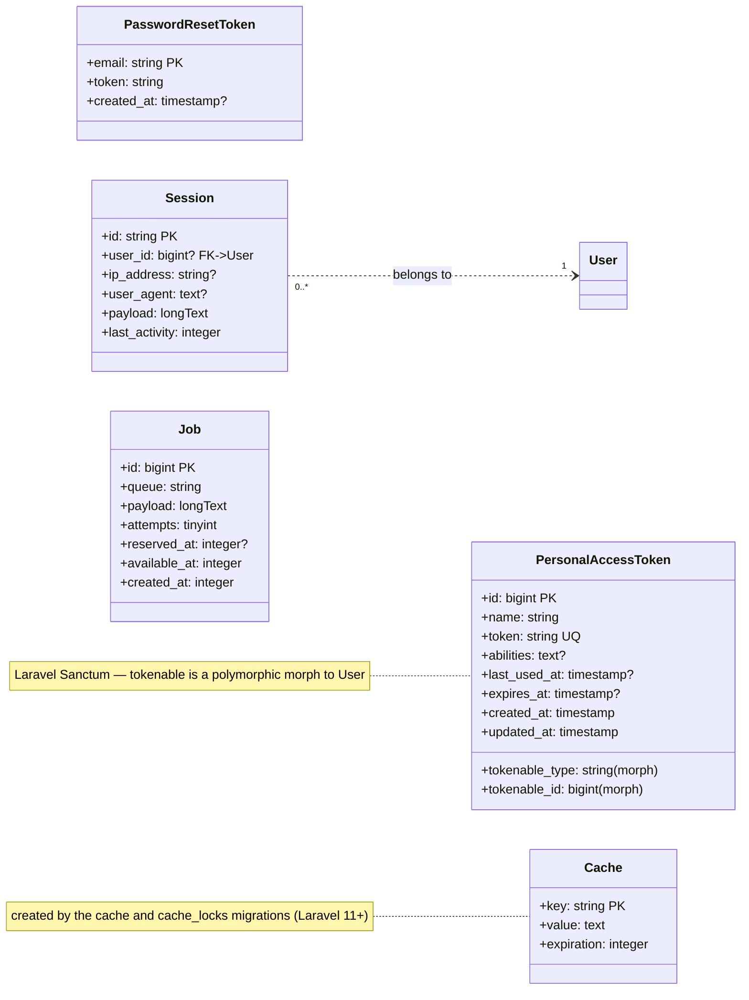

# Architecture — Database Schema (UML)

> This document describes the **full database schema** of the Visit Jijel backend as a UML class diagram.
> Each table is represented as a class, each column as an attribute, and each foreign key as an association.
>
> - Solid arrow `-->` : required foreign key.
> - Dashed arrow `..>` : optional (nullable) foreign key.
> - `PK` primary key, `FK` foreign key, `UQ` unique, `AK` alternate key (unique constraint).
> - `?` = nullable column. Enum columns are typed as `enum`; their values are listed in [§3 Enumerations](#3-enumerations).
>
> Source of truth: the Laravel migrations in `database/migrations/`.

---

## 1. Domain model — UML class diagram

```mermaid
classDiagram
    direction TB

    %% ─────────────── Core / Identity ───────────────
    class User {
        +id: bigint PK
        +name: string
        +email: string UQ
        +email_verified_at: timestamp?
        +password: string
        +remember_token: string?
        +is_admin: boolean
        +is_super_admin: boolean
        +must_reset_password: boolean
        +created_by: bigint? FK->User
        +created_at: timestamp
        +updated_at: timestamp
    }

    class Profile {
        +id: bigint PK
        +user_id: bigint FK UQ
        +role: enum
        +phone: string?
        +bio: string?
        +wilaya: string?
        +commune: string?
        +created_at: timestamp
        +updated_at: timestamp
    }

    User "1" --> "1" Profile : has

    %% ─────────────── Businesses & Listings ───────────────
    class Business {
        +id: bigint PK
        +owner_id: bigint FK->User
        +type: enum
        +name: string
        +description: text?
        +phone: string?
        +email: string?
        +website: string?
        +address: text?
        +latitude: decimal?
        +longitude: decimal?
        +wilaya: string?
        +commune: string?
        +is_verified: boolean
        +is_active: boolean
        +created_at: timestamp
        +updated_at: timestamp
    }

    class Listing {
        +id: bigint PK
        +business_id: bigint FK
        +title: string
        +description: text?
        +price: decimal?
        +currency: string
        +amenities: json?
        +capacity: integer?
        +status: enum
        +metadata: json?
        +created_at: timestamp
        +updated_at: timestamp
    }

    User "1" --> "0..*" Business : owns
    Business "1" --> "0..*" Listing : has

    %% ─────────────── Destinations & Events ───────────────
    class Destination {
        +id: bigint PK
        +name: string
        +arabic_name: string?
        +description: text?
        +arabic_description: text?
        +address: text?
        +arabic_address: text?
        +latitude: decimal?
        +longitude: decimal?
        +category: enum
        +arabic_category: string?
        +is_featured: boolean
        +state: enum
        +tags: json?
        +created_at: timestamp
        +updated_at: timestamp
    }

    class Event {
        +id: bigint PK
        +business_id: bigint? FK->Business
        +destination_id: bigint? FK->Destination
        +created_by: bigint FK->User
        +title: string
        +description: text?
        +starts_at: timestamp
        +ends_at: timestamp
        +price: decimal?
        +location: string?
        +latitude: decimal?
        +longitude: decimal?
        +max_attendees: integer?
        +status: enum
        +created_at: timestamp
        +updated_at: timestamp
    }

    User "1" --> "0..*" Event : created_by
    Business "1" ..> "0..*" Event : hosts
    Destination "1" ..> "0..*" Event : takes place at

    %% ─────────────── Itineraries ───────────────
    class Itinerary {
        +id: bigint PK
        +user_id: bigint FK->User
        +title: string
        +notes: text?
        +start_date: date?
        +end_date: date?
        +visibility: enum
        +created_at: timestamp
        +updated_at: timestamp
    }

    class ItineraryDay {
        +id: bigint PK
        +itinerary_id: bigint FK
        +day_date: date
        +day_number: integer AK (itinerary_id, day_number)
        +notes: text?
        +created_at: timestamp
        +updated_at: timestamp
    }

    class ItineraryItem {
        +id: bigint PK
        +itinerary_day_id: bigint FK
        +destination_id: bigint? FK
        +listing_id: bigint? FK
        +event_id: bigint? FK
        +title: string
        +notes: text?
        +start_time: time?
        +end_time: time?
        +sort_order: integer
        +item_type: enum
        +created_at: timestamp
        +updated_at: timestamp
    }

    User "1" --> "0..*" Itinerary : owns
    Itinerary "1" --> "0..*" ItineraryDay : has
    ItineraryDay "1" --> "0..*" ItineraryItem : has
    Destination "1" ..> "0..*" ItineraryItem : referenced in
    Listing "1" ..> "0..*" ItineraryItem : referenced in
    Event "1" ..> "0..*" ItineraryItem : referenced in

    %% ─────────────── Calendar ───────────────
    class CalendarEvent {
        +id: bigint PK
        +user_id: bigint FK->User
        +itinerary_id: bigint? FK->Itinerary
        +event_id: bigint? FK->Event
        +title: string
        +notes: text?
        +starts_at: timestamp
        +ends_at: timestamp
        +color: string?
        +all_day: boolean
        +source: enum
        +created_at: timestamp
        +updated_at: timestamp
    }

    User "1" --> "0..*" CalendarEvent : owns
    Itinerary "1" ..> "0..*" CalendarEvent : linked to
    Event "1" ..> "0..*" CalendarEvent : linked to

    %% ─────────────── Reviews ───────────────
    class Review {
        +id: bigint PK
        +user_id: bigint FK->User
        +listing_id: bigint? FK
        +destination_id: bigint? FK
        +event_id: bigint? FK
        +rating: tinyint (1-5)
        +body: text?
        +is_approved: boolean
        +created_at: timestamp
        +updated_at: timestamp
    }

    User "1" --> "0..*" Review : writes
    Listing "1" ..> "0..*" Review : receives
    Destination "1" ..> "0..*" Review : receives
    Event "1" ..> "0..*" Review : receives

    %% ─────────────── Media (polymorphic) ───────────────
    class Media {
        +id: bigint PK
        +model_type: string (polymorphic)
        +model_id: bigint (polymorphic)
        +cloudinary_public_id: string UQ
        +url: string
        +secure_url: string
        +format: string?
        +resource_type: string
        +width: unsignedInteger?
        +height: unsignedInteger?
        +size: bigint?
        +collection: string
        +is_cover: boolean
        +sort_order: unsignedSmallInteger
        +created_at: timestamp
    }

    note for Media "Polymorphic morphTo — model_type + model_id reference any model: Destination, Business, Event, Listing, User, ..."

    %% ─────────────── Billing ───────────────
    class Plan {
        +id: bigint PK
        +name: string
        +description: text?
        +price: decimal
        +currency: string
        +max_businesses: integer
        +max_listings_per_business: integer
        +featured_listing: boolean
        +is_active: boolean
        +created_at: timestamp
        +updated_at: timestamp
    }

    class Subscription {
        +id: bigint PK
        +user_id: bigint FK->User
        +plan_id: bigint FK->Plan
        +status: enum
        +starts_at: timestamp?
        +expires_at: timestamp?
        +created_at: timestamp
        +updated_at: timestamp
    }

    class Payment {
        +id: bigint PK
        +user_id: bigint FK->User
        +subscription_id: bigint FK->Subscription
        +amount: decimal
        +currency: string
        +status: enum
        +method: enum?
        +reference: string?
        +paid_at: timestamp?
        +created_at: timestamp
        +updated_at: timestamp
    }

    User "1" --> "0..*" Subscription : subscribes to
    Plan "1" --> "0..*" Subscription : offered by
    Subscription "1" --> "0..*" Payment : settled by
    User "1" --> "0..*" Payment : pays

    %% ─────────────── Activity logging ───────────────
    class ActivityLog {
        +id: bigint PK
        +log_name: string?
        +description: text
        +subject_type: string? (morph)
        +subject_id: bigint? (morph)
        +event: string?
        +causer_type: string? (morph)
        +causer_id: bigint? (morph)
        +attribute_changes: json?
        +properties: json?
        +created_at: timestamp
        +updated_at: timestamp
    }

    note for ActivityLog "Spatie laravel-activitylog — subject and causer are polymorphic morphs to any model"

    %% ─────────────── Admin self-reference ───────────────
    User "1" ..> "0..*" User : created_by (admins)
```

---

## 2. Platform / framework tables

These are Laravel framework tables (`auth`, `cache`, `jobs`, `sessions`) — not part of the domain model, but part of the physical schema.

---

## 3. Enumerations

| Table | Column | Values |
|---|---|---|
| `profiles` | `role` | `business_owner`, `client` (legacy `admin` was migrated to `users.is_admin` and removed from the enum) |
| `businesses` | `type` | `restaurant`, `touristic_agency`, `real_estate_agency`, `hotel` |
| `listings` | `status` | `draft`, `published`, `archived` |
| `destinations` | `category` | `nature`, `historical`, `beach`, `urban`, `cultural`, `sport` |
| `destinations` | `state` | `active`, `inactive` |
| `events` | `status` | `draft`, `published`, `cancelled` |
| `itineraries` | `visibility` | `private`, `public`, `shared` |
| `itinerary_items` | `item_type` | `destination`, `listing`, `event`, `custom` |
| `calendar_events` | `source` | `manual`, `itinerary`, `event` |
| `subscriptions` | `status` | `active`, `expired`, `cancelled`, `pending` |
| `payments` | `status` | `pending`, `paid`, `failed`, `refunded` |
| `payments` | `method` | `cash`, `ccp`, `baridimob`, `bank_transfer` (nullable) |
| `media` | `resource_type` | `image`, `video`, `raw` (defaults to `image`) |

---

## 4. Key notes

- **Roles are stored on two axes:** `users.is_admin` / `users.is_super_admin` flags for administrative access (the admin panel), while `profiles.role` holds the public-facing identity (`business_owner` / `client`). `User::getRoleAttribute()` derives the effective role from these.
- **Polymorphic relations:** `media` attaches to any model via `model_type` + `model_id`; `activity_log` tracks changes for any model; `personal_access_tokens` authenticates any model.
- **Nullable FKs with `nullOnDelete`:** `events.business_id`, `events.destination_id`, `calendar_events.itinerary_id`, `calendar_events.event_id`, `itinerary_items.destination_id/listing_id/event_id` — the child row survives if the parent is deleted.
- **Optional review subjects:** a `review` may target a listing, a destination, or an event (all nullable).
